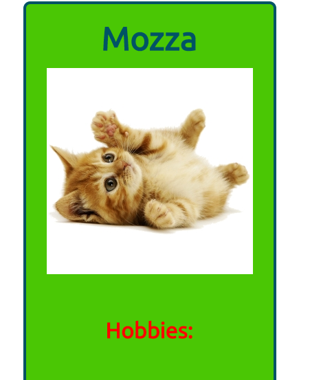

# Random Box

## Objetivo

+ Crear un box random (que cambie el color de la caja y el mensaje al actualizar la página) desde React.
## Desarrollo
Para su desarrollo se hizo uso de la libreria React, y la extensión de sintaxis de JavaScript JSX
 

## Desarrollado para [Laboratoria](http://www.laboratoria.la/)
